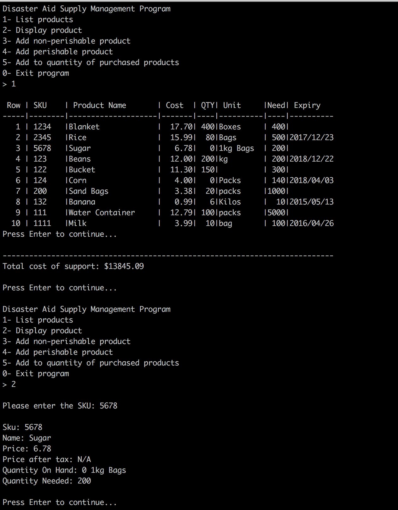

# storehouse-inventory-console

This is a console based inventory management application in C++ that is used to create, view, update and delete goods that can be stored in a storehouse. In the image below, it's being used as an inventory tracker for goods distributed during a disaster such as an earthquake, etc. The user can create new perishable or non-perishable goods to add to their collection, and can specify related data such as ID, name, price, quantity, etc. Supports console and file I/O.

## Instructions

Note: This was done on a Linux system

1. Navigate to the repo after cloning or downloading
2. Run `g++ -Wall -std=c++0x -O2 -o invmanage AmaProduct.cpp AmaPerishable.cpp Product.cpp Date.cpp ErrorMessage.cpp AidApp.cpp aidAppMain.cpp`
3. Run `invmanage`

## Screenshot

